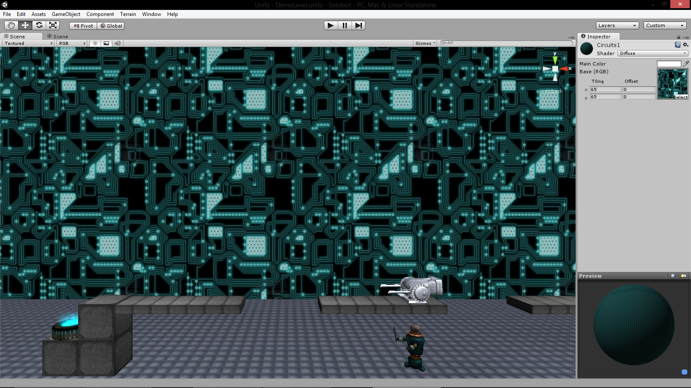

# Creating Normal Maps with NVIDIA Texture Tools

## Introduction

Texture is a large part of a human's visual experience. There are not many matierals in the real world that are completely flat and devoid of texture. In creating games, many objects such as a wooden crate or a carpeted floor will be modeled using the minimal amount of polygons in the geometry such as using simple box for the crate or a flat plane for the carpet. Adding an RGB image to texture these objects helps to provide a bit of visual information about the material. However, because a simple cube is being used for the geometry it will still appear flat and when viewed at certain angles, lighting in a 3D space will give away the fact that there is only a picture of a textured material pasted onto a completely flat surface. This hinders the realism that can be acheived in a game.

One solution to this problem could be to make our geometry more closely conform to the actual object we're attempting to model. Instead of using a simple cube to model a crate, use many sizes and shapes of rectangles to represent the planks that make up the crate individually. Some of the planks will stick out farther than others. This is an ideal solution as we are giving our objects actual texture through its geometry. However, the more complex the geometry in our game, the less time you will have per frame in order to do other processing such as physics handling and AI controllers. UV mapping a texture onto the object also becomes non-trivial when the geometry is complex.

## So Why Should I Care?

Instead of using incredibly complex geometry for modeling the surface of a textured object such as a carpeted rug, usually a technique called **normal mapping** is applied in order to mitigate the above problems. For my side-scroller demo Solobot created in Unity we found a scratched up metallic looking texture for our platforms and crates. We thought it looked good so we used it for our main platform texture. Here is what it looked like before applying a normal map:

#### Before Applying Normal Mapping To Crate

And this is what it looks like after using NVIDIA's Texture Tools in order to generate a normal map and applying it in Unity via the material's shader. In both screenshots only a simple cube is used for the geometry of the crate:

#### After Applying Normal Mapping To Crate

## So What Is It?

A **normal map** is nothing more than a regular RGB image. In order to understand how it is used to create more detailed visuals in games you have to know how Lamertian (diffuse) lighting is calculated across a surface. 

In order to calculate the **diffuse lighting** for a particular point on a surface given the position of a light source you take the dot product of the vector from the point to the light source and the normal vector from the surface at that point. In other words, if we have a light source at the point represented by vector **L**, and we have a point on a surface at **P** with a normal vector from the surface at that point of **N** then the intensity of the light source at that point is calculated as:

 * `i` = (**L** - **P**) &middot; **N**

This intensity `i` will always be a value between 0 and 1, with a maximum value representing 100% intesity and a value of 0 representing no lighting from that source. The intensity will be 1 if the normal vector and the vector from the point and two the light source are the same direction. If the two vectors are orthogonal (perpendicular) to one another then the value will be 0.

A normal map is an RGB image for which the red, green, and blue channels at a particular pixel represent the normal vector for the surface point at which that texture coordinate is applied in the game. The R, G, and B channels hold a single byte value between 0 and 255 for each color and each value represents the X, Y, and Z coordinates of the normal vector respectively for that particular pixel. When a normal map is applied, the normal vectors from the normal map are used in place of the actual normal vectors from the geometry of the object to which the texture and normal map are applied. 

In the case of the crate shown above, instead of the crate only having 6 different normal vectors for which lighting will be varied, using normal mapping there is a different normal for each pixel of the crate shown which is used to calculate the lighting. The following normal map is the one used to create the details shown in the after image above, at each pixel the different RGB values determine the normal vector which will be used in the lighting calculations for that particular pixel on the texture to which the map is applied.

Here is a more detailed normal map which we used to give our circuits backdrop a little bit more of a bumpy look.

And here is another set of before and after pictures showing the difference the above normal map makes in the detail of our backdrop.

#### Before Applying Normal Mapping To Our Backdrop

#### After Applying Normal Mapping To Our Backdrop

## I Can Normal Map and You Can Too

So you may be wondering how you can easily use this technique in games that you create. It would take forever to create a normal map for a given texture by hand, not to mention the effort involved in figuring out what each normal vector should be for each pixel. Instead, usually software tools are employed in order to help generate normal mappings for textures.

### NVIDIA's Texture Tools

NVIDIA makes a great filter for photoshop which allows you to easily create normal maps for your textures. In order to create the normal maps shown above I simply opened them up in Photoshop and ran the normal map filter on it, changed a few values using the (too tiny) preview window, and wa-la- Le normal maps are served.

[**NVIDIA's Texture Tools for Adobe Photoshop**][1] on any version 5.0 or later. This includes all of the creative suite versions as well. It comes with a few extra things, but what you'll be needing is the NVIDIA Normal Map Filter and a working copy of Photoshop.

Once you have that downloaded and installed you can open up a sample texture in Photoshop. I am going to use the wooden crate texture shown at the top of this article. Once you have your texture open, select from the upper menu `Filters --> NVIDIA Tools --> NormalMapFilter` in order to bring up the tool. For the most part it does a good job of generating the normal map pretty well using the default settings but a few you may want to tweak are the **Scale** option which controls the height scale at which the filter is applied and the **Min Z** which controls the minimum height scale.

[1]: https://developer.nvidia.com/nvidia-texture-tools-adobe-photoshop